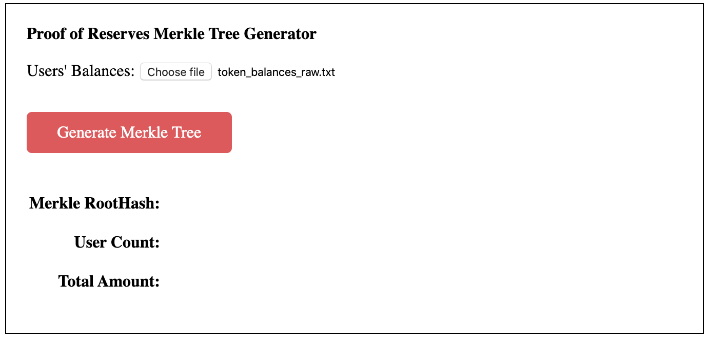
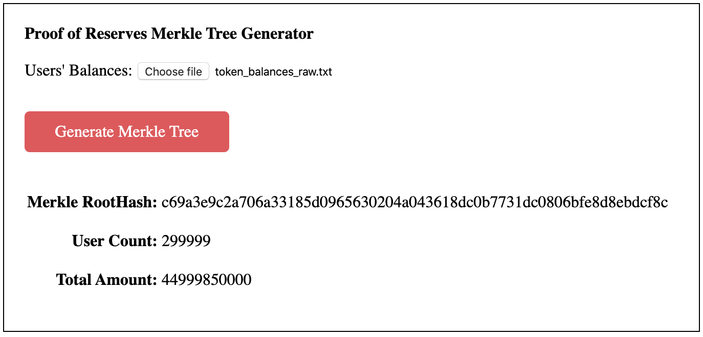
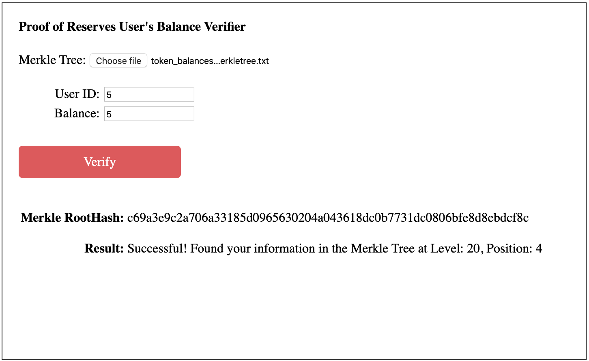
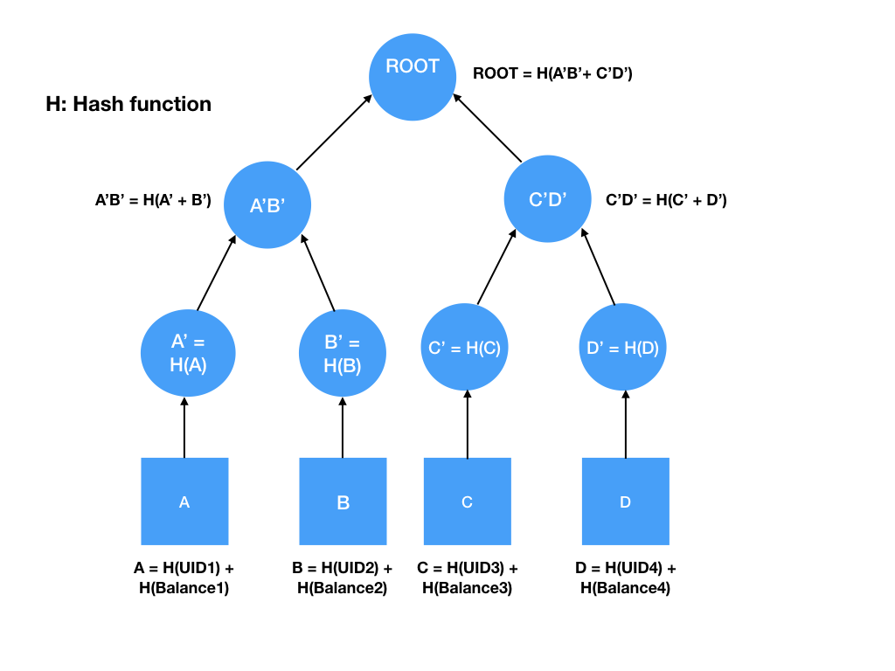
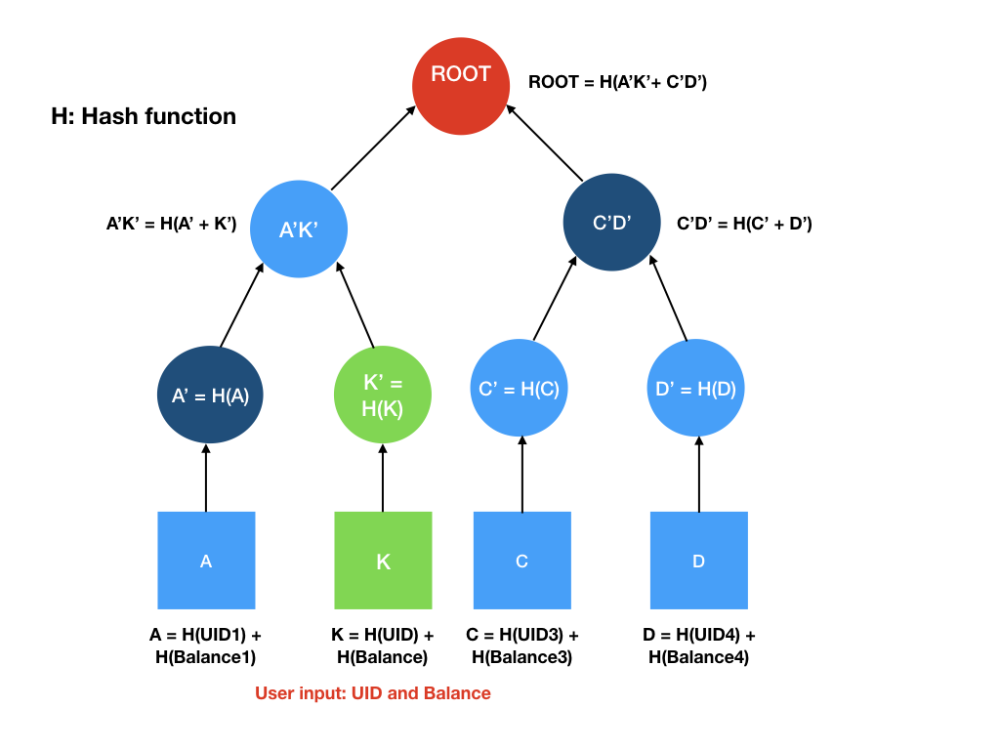

# Gate.io Proof-of-Reserves

- [Gate.io Proof-of-Reserves](#gateio-proof-of-reserves)
  - [Introduction](#introduction)
  - [Background](#background)
  - [Process Overview](#process-overview)
  - [Technical Details](#technical-details)
  - [Installation](#installation)
  - [Usage](#usage)
  - [Notes](#notes)
  
## Introduction
This document introduces the background and guidance regarding Gate's audit process of Proof-of-Reserves, in order to transparently prove to customers that Gate held full reserves of their funds.

## Background
One of the core problems with cryptocurrency exchanges is transparency, which primarily involves in the proof of reserves. Because customers need to know and confirm that the service they are using does in fact hold 100% of their funds. Hence, Gate came up with this solution utilizing the Merkle tree approach to give customers the ability to verify their fund is fully held by Gate; besides, an independent and cryptographically-verified audit was employed to help with the audit process.

## Process Overview
* ### Auditor generates the Merkle tree with user balances provided by Gate
   Gate provides the auditor with all the details of user balances on a token basis. The auditor will then import the user balances into generator.html to generate the Merkle tree, as shown below:

   <p align="center"> 
    
   </P>

* ### Auditor verifies the total user balance and publish the merkle tree and root hash
   After the Merkle tree successfully generated in generator.html, its root hash together with user count and total amount of user balances will be calculated and displayed to the auditor for verification.
   
   The leaves of the Merkle tree will be saved in a plain text file, which will be publicly shared to customers on Github to verify individual's account balance.
   
   <p align="center"> 
    
   </P>
  

* ### User independently verify their account balance
   User needs to first get the published Merkle tree from Github, import into verifier.html, and then input his/her own User ID and token balance to trigger the verification process. If the UID and balance provided by user matches the record in the Merkle tree, a successful result will be displayed together with the node location of user information within the Merkle tree. The Merkle tree's root hash will be re-calculated using the imported file so that user can verify the root hash to ensure the correctness and completeness of the Merkle tree.
   
   <p align="center">
    
   </p>


## Technical Details
* ### What is Merkle Tree?
   In cryptography and computer science, a hash tree or Merkle tree is a tree in which every leaf node is labelled with the cryptographic hash of a data block, and every non-leaf node is labelled with the hash of the labels of its child nodes. Hash trees allow efficient and secure verification of the contents of large data structures.

* ### How to build the Merkle tree with user id and user balance?
   User id (UID) and user balances are first exported from Gate's database. Each pair of UID and user balance will be hashed respectively, and then concatenated to form the underlying data block.
   For each data block, the same hash function will be applied to generate the leaf nodes of the Merkle tree. The resulting hashed data are subsequently hashed together in pairs to create the parent nodes of the leaf nodes. This process continues until it results in a single hash known as the merkle root. Please refer to the diagram below for illustration. After the merkle tree is successfully built, the leaf nodes will be exported into a plain text file, which will be published together with the merkle root hash by the auditor.

   <p align="center">
    
   </p>


* ### Verify user id and balance using Merkle proof
   In order to verify the input user id (UID) and user balance, we need to construct a merkle proof to verify the inclusion of such data within the Merkle tree. 

    Merkle proofs are established by hashing the concatenation of hashed UID and hashed user balance, and climbing up the tree until obtaining the root hash, which has been published by the auditor in step #2.

    The merkle proofs are explained with following example.

    In order to verify the inclusion of data (UID, Balance) from user input, in the merkle tree root, we use a one way function to hash the hashed value of UID and Balance to obtain data K, and then we apply the same hash function on data K to obtain H(K), denoted by K'. In order to validate the inclusivity of K, K doesn't have to be revealed, similarly, the hash of data A can be revealed without any implicit security repercussions and so on. 

    Taking the calculations steps below:
    * K' when hashed with the hash of the unknown dataset A, yields A'K', which is H(A' + K')
    * A'K' hashed with C'D' leads to the root, H(A'K' + C'D')
    * Compare the value of H(A'K' + C'D') with the published merkle root hash

   Hence, we can prove whether the uer input data of (UID, Balance) is present or not in our merkle tree, wihtout having to reveal any other customer's user id or balance.

   <p align="center">
    
   </p>

## Installation
* Install dependencies
  ```shell
  npm install
  ```
* Install build tool
  ```shell
  npm install -g browserify watchify
  ```
* Create bundle.js to make it runanble in browser
  ```shell
  browserify app.js -o bundle.js
  ```
  or to achieve auto change detection and auto update of bundle.js, use watchify as shown below, use nohup to make this watchify command running at background
  ```shell
  nohup watchify app.js -o bundle.js -v > nohup.out 2>&1 </dev/null &
  ```

## Usage
* Open `generator.html` in browser, import file with UID and user balances to build Merkle tree
* Open `verifier.html` in browser, to validate UID and balance combination

## Notes
* `app.js` core logic to build Merkle tree and perform validation
* `FileSaver.js` plugin to save files
* `package.json` holds various metadata relevant to the project and handle the project's dependencies
* `generator.html` html page to build Merkle tree and calculate merkle root hash
* `verifier.html` html page to validate user id and user balance